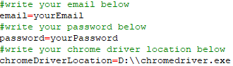

#  Test Automation

## Description
> <b>What is <i>Comodo One<i>?</b>

[Comodo One](https://one.comodo.com/) is scalable IT management platform. The users of Comodo One can manage their all costumer's computers just using a remote connection. Comodo One have a lot of advantages.In IT system management tools, the users can use RMM(romote monitoring and management), romote control and access, automated patch management, mobile device management, network performance, network assessment tool, analytics&reporting.

> <b>What is this project about?</b>

Comodo One is an automation test I developed as long as I did my internship at Comodo. This project includes various frameworks which I used in my automation test project.
- Maven
- TestNG
- Selenium
- Log4J
- Allure Test Report
- Jenkins

I wrote Comodo One login page, Comodo One menu page and account login test. I followed the page object model(POM) rules when I developed this project. This project was created as a Maven project so no external installation if you want to try project. I wrote all necessary code into the pom.xml file for Allure Test Report and Jenkins. When you compile project with Maven, it creates Allure test report automatically. I used Allure Features(attachments-image,file) in my project. This project is suitable for working in Jenkins. In addition I used Log4J for logging and java properties to hide my Comodo One account informations.

> <b>Jenkins Integration</b>

###### Jenkins
 - First we should dowload <b>[Jenkins](https://jenkins.io/download/)</b>.
 - Now, we can run Jenkins on our web browser. We should enter our local host to open Jenkins panel. 
 •	http://localhost:8080
 - We should register Jenkins to enter our automation server.

###### Allure
 - After login our automation server, we should setup Allure plugin into Jenkins. 
  • Click Manage <b>Jenkins</b> > <b>Manage Plugins</b>
 - We sould specify the location of Allure to the Jenkins. You can check install automatically or choose on your computer. 
  • Click <b>Manage Jenkins<b> > <b>Global Tool Configuration</b>

  

###### Maven  
 - We should setup Maven plugin into Jenkins. The setup process is same as Allure plugin.
 - After setup process, we should specify jdk and maven in our computer or install automatically to the Jenkins. Click Manage Jenkins>Global Tool Configuration.
  

  

 - Then, we should write some codes into pom.xml file to build on Jenkins. We need to write maven-compiler-plugin into plugins.

  

 - We should add following configuration into surfire plugin configuration part so if we want to build maven project on Jenkins, Jenkins automatically understand testng.xml location. We should add following configuration into surfire plugin configuration part.

  

###### Github
 - We should setup GitHub plugin into Jenkins.
 - Create a new job. Job is new project in Jenkins. We can create different style project. Jobs allow us to connect plugins so we can more action in one job.
 - Firstly, we should click <b>New Item</b> to create a new job. We need to enter the project name and choose <b>maven project</b>. In job configuration page, I chose GitHub Project because I want to received codes from GitHub and built them. I wrote the my GitHub project address in the Project url box.

  

 - In <b>Source Code Management</b> part, I chose Git radio button.I wrote again my GitHub project address into the Repository URL box.

  

###### Other Job Settings
  - In Build part, we need to specify pom.xml file and write maven code into Goals and options box.I wrote pom.xml direcly because we specify project folder location before.
	In Goals and options box, 'clean test' means first clean old test results and then execute testng.xml file.

    

  - In <b>Post-build Actions</b> part determines what will happen after the build process in this section. We can choose these actions from Add post-build actions button. We could see Allure Report in this section because we setuped Allure Plugin to Jenkins.
	Select Allure Report and specify allure-results folder because our report results in there.

    

  - After all these steps we should click Save button.Now, our project has been created.In project, if we click <b>Build Now</b> button, our project compile automaticaly and then we can see our test results on Allure.

> <b>Java Properties File</b>

  - You should fill in the properties file correctly. Otherwise the automation is not worked!
  - You should write your account information and chrome driver location into <b>src/main/resources/config.properties</b>

    

> <b>Result</b>

   

## Credits
- Oktay Koçer

## License

- [License File](LICENSE)
